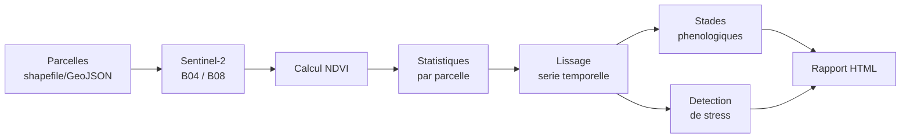
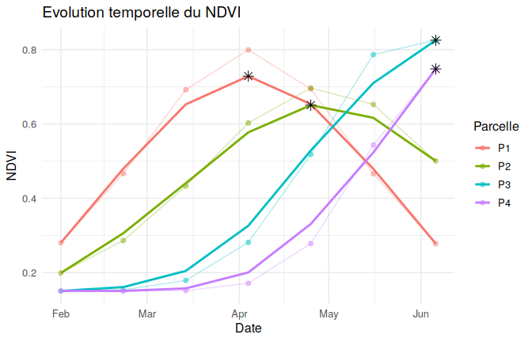
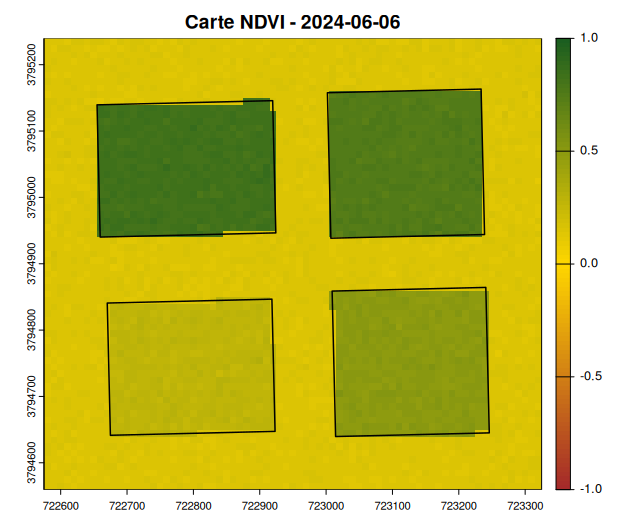

<!-- README.md is generated from README.Rmd. Please edit that file -->
<!-- Pour regenerer : devtools::build_readme() -->

# ndviMonitor

<!-- badges: start -->

[](https://github.com/abdelhamidellaoui-bot/ndviMonitor/actions/workflows/R-CMD-check.yaml)
[](https://opensource.org/licenses/MIT)
[](https://lifecycle.r-lib.org/articles/stages.html#experimental)
[](https://cran.r-project.org/)
<!-- badges: end -->

> Package R pour le **suivi phénologique des cultures** par séries
> temporelles **NDVI**, à partir d’images satellite **Sentinel-2**.

`ndviMonitor` fournit un flux de travail complet, reproductible et
documenté : import de parcelles agricoles → téléchargement d’images
Sentinel-2 → calcul du NDVI → extraction par parcelle → lissage →
détection de stades phénologiques et d’anomalies de stress →
visualisations → rapport HTML automatique.

Développé dans le cadre d’un projet académique de développement de
package R.

------------------------------------------------------------------------

## Table des matières

- [Aperçu](#aperçu)
- [Fonctionnalités](#fonctionnalités)
- [Structure du projet](#structure-du-projet)
- [Installation](#installation)
  - [Prérequis](#prérequis)
  - [Installer depuis GitHub](#installer-depuis-github)
  - [Installer depuis l’archive
    source](#installer-depuis-larchive-source)
  - [Dépannage installation](#dépannage-installation)
- [Démarrage rapide](#démarrage-rapide)
- [Guide d’utilisation détaillé](#guide-dutilisation-détaillé)
  - [1. Importer des parcelles](#1-importer-des-parcelles)
  - [2. Télécharger des images
    Sentinel-2](#2-télécharger-des-images-sentinel-2)
  - [3. Calculer le NDVI](#3-calculer-le-ndvi)
  - [4. Extraire le NDVI par parcelle](#4-extraire-le-ndvi-par-parcelle)
  - [5. Lisser la série temporelle](#5-lisser-la-série-temporelle)
  - [6. Détecter les stades
    phénologiques](#6-détecter-les-stades-phénologiques)
  - [7. Détecter les anomalies de
    stress](#7-détecter-les-anomalies-de-stress)
  - [8. Visualiser les résultats](#8-visualiser-les-résultats)
  - [9. Générer un rapport
    automatique](#9-générer-un-rapport-automatique)
- [Données](#données)
- [Tests et qualité du code](#tests-et-qualité-du-code)
- [FAQ](#faq)
- [Pistes d’amélioration](#pistes-damélioration)
- [Comment contribuer](#comment-contribuer)
- [Licence](#licence)
- [Citation](#citation)

------------------------------------------------------------------------

## Aperçu

Le NDVI (*Normalized Difference Vegetation Index*) est l’indice de
végétation le plus utilisé en agriculture de précision pour suivre la
croissance des cultures à partir d’images satellite. `ndviMonitor`
automatise les étapes répétitives de ce suivi :



Le package est conçu pour être utilisable **immédiatement**, sans
connexion Internet, grâce à un jeu de données de démonstration
synthétique mais réaliste (voir [Données](#données)) — et pour basculer
en un instant vers de **vraies images Sentinel-2** via le catalogue
public et gratuit **Microsoft Planetary Computer**.

## Fonctionnalités

| Fonction                | Rôle                                      | Entrée principale   | Sortie                            |
|-------------------------|-------------------------------------------|---------------------|-----------------------------------|
| `import_parcels()`      | Importer des parcelles agricoles          | `.shp` / `.geojson` | objet `sf`                        |
| `download_sentinel()`   | Télécharger des images Sentinel-2 réelles | objet `sf`, dates   | bandes B04/B08 (`.tif`)           |
| `calc_ndvi()`           | Calculer le NDVI                          | bandes Rouge/NIR    | `SpatRaster` multi-couches        |
| `extract_ndvi()`        | Statistiques NDVI par parcelle            | `SpatRaster` + `sf` | `data.frame` long                 |
| `smooth_timeseries()`   | Lisser la série temporelle                | `data.frame` NDVI   | `data.frame` + colonne `smoothed` |
| `detect_growth_stage()` | Détecter croissance / pic / sénescence    | `data.frame` NDVI   | `data.frame` (1 ligne/parcelle)   |
| `detect_stress()`       | Détecter des anomalies de végétation      | `data.frame` NDVI   | `data.frame` + colonnes d’alerte  |
| `plot_ndvi_curve()`     | Tracer les courbes NDVI                   | `data.frame` NDVI   | objet `ggplot`                    |
| `plot_ndvi_map()`       | Cartographier le NDVI                     | `SpatRaster`        | carte (périphérique graphique)    |
| `generate_report()`     | Rapport HTML automatique                  | tables + raster     | fichier `.html`                   |

Fonctions utilitaires de démonstration : `ndvi_demo_stack()`,
`ndvi_demo_table()`, jeu de données `demo_parcels`.

## Structure du projet

    ndviMonitor/
    ├── DESCRIPTION                  # metadonnees, dependances
    ├── NAMESPACE                    # genere par roxygen2 (ne pas editer)
    ├── LICENSE / LICENSE.md         # licence MIT
    ├── NEWS.md                      # journal des versions
    ├── README.Rmd / README.md       # ce fichier
    ├── ndviMonitor.Rproj            # projet RStudio
    ├── .Rbuildignore / .gitignore
    ├── .github/workflows/
    │   └── R-CMD-check.yaml         # integration continue (CI)
    ├── R/                           # code source des fonctions
    │   ├── import_parcels.R
    │   ├── download_sentinel.R
    │   ├── calc_ndvi.R
    │   ├── extract_ndvi.R
    │   ├── smooth_timeseries.R
    │   ├── detect_growth_stage.R
    │   ├── detect_stress.R
    │   ├── plot_ndvi_curve.R
    │   ├── plot_ndvi_map.R
    │   ├── generate_report.R
    │   ├── data.R                   # doc + acces aux donnees demo
    │   ├── ndviMonitor-package.R    # doc niveau package
    │   └── zzz.R
    ├── man/                         # documentation .Rd (generee)
    ├── data/
    │   └── demo_parcels.rda         # 4 parcelles (plaine du Gharb)
    ├── inst/
    │   ├── extdata/
    │   │   ├── demo_parcels.geojson
    │   │   └── sentinel_demo/       # bandes Sentinel-2 synthetiques (.tif)
    │   └── rmd/
    │       └── report_template.Rmd  # gabarit du rapport HTML
    ├── data-raw/
    │   └── generate_demo_data.R     # script de generation des donnees demo
    ├── vignettes/
    │   └── ndviMonitor-intro.Rmd    # tutoriel complet
    └── tests/
        └── testthat/                # 58 tests unitaires
            ├── test-calc_ndvi.R
            ├── test-extract_ndvi.R
            ├── test-import_parcels.R
            ├── test-smooth_timeseries.R
            ├── test-detect_growth_stage.R
            ├── test-detect_stress.R
            ├── test-plot_ndvi.R
            └── test-download_sentinel.R

## Installation

### Prérequis

- **R ≥ 4.1** : <https://cran.r-project.org/>

- Les packages `sf` et `terra` dépendent des bibliothèques système
  **GDAL**, **GEOS** et **PROJ**. Sous Windows et macOS, les binaires
  CRAN les embarquent automatiquement — aucune action requise. Sous
  Linux (Ubuntu/Debian) :

  ``` bash
  sudo apt-get install libgdal-dev libgeos-dev libproj-dev
  ```

### Installer depuis GitHub

``` r
install.packages("remotes")
remotes::install_github("abdelhamidellaoui-bot/ndviMonitor", build_vignettes = TRUE)
```

### Installer depuis l’archive source

Si vous disposez du fichier `ndviMonitor_0.1.0.tar.gz` (par exemple
fourni séparément du dépôt) :

``` r
install.packages("ndviMonitor_0.1.0.tar.gz", repos = NULL, type = "source")
```

### Dépannage installation

<details>
<summary>
<strong>Erreur « Could not resolve hostname » / impossible de
télécharger des packages</strong>
</summary>

C’est un problème de connexion réseau locale (DNS, proxy, pare-feu), pas
un problème du package. À essayer dans l’ordre :

``` r
# 1. Changer de miroir CRAN
options(repos = c(CRAN = "https://cloud.r-project.org"))

# 2. Sous Windows, methode de telechargement alternative
options(download.file.method = "wininet")

install.packages("sf")
```

Si vous êtes sur un réseau d’entreprise/université avec proxy,
configurez-le :

``` r
Sys.setenv(http_proxy  = "http://adresse_proxy:port")
Sys.setenv(https_proxy = "http://adresse_proxy:port")
```

Vérifiez aussi qu’un pare-feu/antivirus ne bloque pas R, et testez la
connexion dans un navigateur sur <https://cran.r-project.org>.
</details>
<details>
<summary>
<strong>Échec d’installation de <code>sf</code> ou <code>terra</code>
(compilation depuis les sources)</strong>
</summary>
Sous Linux, installez d’abord les bibliothèques système (voir
[Prérequis](#prérequis)). Sous Windows/macOS, préférez toujours
`install.packages()` (binaires précompilés) plutôt qu’une installation
depuis les sources.
</details>

## Démarrage rapide

Le package est livré avec un **jeu de données de démonstration**
(parcelles et bandes Sentinel-2 synthétiques) qui permet de tester
l’ensemble du flux de travail **sans connexion Internet**.

``` r
library(ndviMonitor)

# 1. Parcelles agricoles de demonstration (plaine du Gharb, Kenitra)
data(demo_parcels)
demo_parcels
#>   parcel_id               crop area_ha
#> 1        P1                Ble    4.95
#> 2        P2 Betterave sucriere    5.08
#> 3        P3               Mais    5.28
#> 4        P4                Riz    5.08
#>                                                                                                       geometry
#> 1 -6.581347, -6.578653, -6.578653, -6.581347, -6.581347, 34.269102, 34.269102, 34.270898, 34.270898, 34.269102
#> 2 -6.577664, -6.575149, -6.575149, -6.577664, -6.577664, 34.269012, 34.269012, 34.270988, 34.270988, 34.269012
#> 3 -6.581437, -6.578563, -6.578563, -6.581437, -6.581437, 34.271797, 34.271797, 34.273593, 34.273593, 34.271797
#> 4 -6.577664, -6.575149, -6.575149, -6.577664, -6.577664, 34.271707, 34.271707, 34.273683, 34.273683, 34.271707

# 2. Empilement NDVI de demonstration (7 dates, fevrier-juin)
ndvi_stack <- ndvi_demo_stack()

# 3. Extraction des statistiques NDVI par parcelle
ndvi_table <- extract_ndvi(ndvi_stack, demo_parcels)

# 4. Lissage de la serie temporelle
ndvi_table <- smooth_timeseries(ndvi_table, method = "moving_average")

# 5. Detection des stades phenologiques
stages <- detect_growth_stage(ndvi_table)
stages
#>   parcel_id start_growth_date  peak_date peak_ndvi senescence_date
#> 1        P1        2024-02-22 2024-04-04 0.7286444      2024-04-25
#> 2        P2        2024-02-22 2024-04-25 0.6506649      2024-06-06
#> 3        P3        2024-04-04 2024-06-06 0.8254256            <NA>
#> 4        P4        2024-04-25 2024-06-06 0.7481596            <NA>
```

``` r
plot_ndvi_curve(ndvi_table, stages = stages)
```



``` r
plot_ndvi_map(ndvi_stack, parcels = demo_parcels)
```



------------------------------------------------------------------------

## Guide d’utilisation détaillé

### 1. Importer des parcelles

`import_parcels()` lit un shapefile (`.shp`) ou un GeoJSON, vérifie le
système de coordonnées (CRS), ajoute un identifiant `parcel_id` si
nécessaire et affiche un aperçu.

``` r
path <- system.file("extdata", "demo_parcels.geojson", package = "ndviMonitor")
parcels <- import_parcels(path, plot = FALSE)
#> 4 parcelle(s) importee(s) | CRS : WGS 84
parcels
#> Simple feature collection with 4 features and 3 fields
#> Geometry type: POLYGON
#> Dimension:     XY
#> Bounding box:  xmin: -6.581437 ymin: 34.26901 xmax: -6.575149 ymax: 34.27368
#> Geodetic CRS:  WGS 84
#>   parcel_id               crop area_ha                       geometry
#> 1        P1                Ble    4.95 POLYGON ((-6.581347 34.2691...
#> 2        P2 Betterave sucriere    5.08 POLYGON ((-6.577664 34.2690...
#> 3        P3               Mais    5.28 POLYGON ((-6.581437 34.2718...
#> 4        P4                Riz    5.08 POLYGON ((-6.577664 34.2717...
```

Arguments utiles :

- `id_col` : nom de la colonne identifiant déjà présente dans vos
  données (sinon générée automatiquement).
- `target_crs` : code EPSG pour reprojeter à l’import (ex. `32629` pour
  l’UTM zone 29N, utile au Maroc).

### 2. Télécharger des images Sentinel-2

`download_sentinel()` interroge le catalogue **STAC public et gratuit**
[Microsoft Planetary Computer](https://planetarycomputer.microsoft.com/)
(aucune clé API requise) et télécharge les bandes Rouge (B04) et Proche
Infrarouge (B08) sur l’emprise de vos parcelles.

``` r
install.packages("rstac")  # dependance optionnelle

sentinel <- download_sentinel(
  parcels,
  start_date      = "2024-01-01",
  end_date        = "2024-07-01",
  max_cloud_cover = 20,            # % de nuages maximum accepte
  dest_dir        = "sentinel_data"
)

sentinel$files   # chemins des fichiers .tif telecharges
```

### 3. Calculer le NDVI

``` r
red_files <- sentinel$files[grepl("B04", sentinel$files)]
nir_files <- sentinel$files[grepl("B08", sentinel$files)]
dates     <- unique(sub("_B0[48]\\.tif$", "", basename(sentinel$files)))

ndvi_stack <- calc_ndvi(red_files, nir_files, dates = dates)
```

Avec les données de démonstration du package (aucun téléchargement
nécessaire) :

``` r
ndvi_stack <- ndvi_demo_stack()
ndvi_stack
#> class       : SpatRaster 
#> dimensions  : 68, 75, 7  (nrow, ncol, nlyr)
#> resolution  : 10, 10  (x, y)
#> extent      : 722574.8, 723324.8, 3794560, 3795240  (xmin, xmax, ymin, ymax)
#> coord. ref. : WGS 84 / UTM zone 29N (EPSG:32629) 
#> source(s)   : memory
#> varnames    : 2024-02-01_B08 
#>               2024-02-22_B08 
#>               2024-03-14_B08 
#>               ...
#> names       : 2024-02-01, 2024-02-22, 2024-03-14, 2024-04-04, 2024-04-25, 2024-05-16, ... 
#> min values  :  0.1035525, 0.09738267,  0.1023620,  0.1192864,  0.1125286,  0.1143841, ... 
#> max values  :  0.3435555, 0.51152007,  0.7293597,  0.8470030,  0.7432504,  0.8313911, ... 
#> time (days) : 2024-02-01 to 2024-06-06
```

### 4. Extraire le NDVI par parcelle

``` r
ndvi_table <- extract_ndvi(ndvi_stack, parcels, stats = c("mean", "median"))
head(ndvi_table)
#>   parcel_id       date      mean    median
#> 1        P1 2024-02-01 0.2800649 0.2799230
#> 2        P1 2024-02-22 0.4666845 0.4666750
#> 3        P1 2024-03-14 0.6920808 0.6921472
#> 4        P1 2024-04-04 0.7996319 0.8000910
#> 5        P1 2024-04-25 0.6942207 0.6943800
#> 6        P1 2024-05-16 0.4660914 0.4658750
```

### 5. Lisser la série temporelle

Deux méthodes disponibles : moyenne mobile (`"moving_average"`) ou
régression locale (`"loess"`).

``` r
ndvi_table <- smooth_timeseries(ndvi_table, method = "moving_average", window = 3)
head(ndvi_table)
#>   parcel_id       date      mean    median  smoothed
#> 1        P1 2024-02-01 0.2800649 0.2799230 0.2800649
#> 2        P1 2024-02-22 0.4666845 0.4666750 0.4796101
#> 3        P1 2024-03-14 0.6920808 0.6921472 0.6527991
#> 4        P1 2024-04-04 0.7996319 0.8000910 0.7286444
#> 5        P1 2024-04-25 0.6942207 0.6943800 0.6533147
#> 6        P1 2024-05-16 0.4660914 0.4658750 0.4793534
```

### 6. Détecter les stades phénologiques

``` r
stages <- detect_growth_stage(
  ndvi_table,
  growth_threshold = 0.3,   # seuil de debut de croissance
  senescence_drop  = 0.10   # baisse relative declenchant la senescence
)
stages
#>   parcel_id start_growth_date  peak_date peak_ndvi senescence_date
#> 1        P1        2024-02-22 2024-04-04 0.7286444      2024-04-25
#> 2        P2        2024-02-22 2024-04-25 0.6506649      2024-06-06
#> 3        P3        2024-04-04 2024-06-06 0.8254256            <NA>
#> 4        P4        2024-04-25 2024-06-06 0.7481596            <NA>
```

### 7. Détecter les anomalies de stress

``` r
ndvi_table <- detect_stress(ndvi_table, drop_threshold = 0.20)
subset(ndvi_table, alert, select = c(parcel_id, date, alert_type, pct_deviation))
#>    parcel_id       date        alert_type pct_deviation
#> 1         P1 2024-02-01    baisse_brutale   -0.44799794
#> 5         P1 2024-04-25 faible_croissance    0.28766942
#> 6         P1 2024-05-16 faible_croissance   -0.05520454
#> 7         P1 2024-06-06    baisse_brutale   -0.45256431
#> 8         P2 2024-02-01    baisse_brutale   -0.57691335
#> 9         P2 2024-02-22    baisse_brutale   -0.34903967
#> 13        P2 2024-05-16 faible_croissance    0.31161374
#> 14        P2 2024-06-06 faible_croissance    0.06445235
#> 15        P3 2024-02-01    baisse_brutale   -0.63759253
#> 16        P3 2024-02-22    baisse_brutale   -0.61233622
#> 17        P3 2024-03-14    baisse_brutale   -0.50745329
#> 18        P3 2024-04-04    baisse_brutale   -0.21471248
#> 22        P4 2024-02-01    baisse_brutale   -0.53352750
#> 23        P4 2024-02-22    baisse_brutale   -0.53389160
#> 24        P4 2024-03-14    baisse_brutale   -0.51272042
#> 25        P4 2024-04-04    baisse_brutale   -0.37996948
```

> ⚠️ Méthode simple à but pédagogique : comparer chaque date à la
> moyenne historique de la parcelle peut signaler les phases naturelles
> de début/fin de saison comme des anomalies. En production, privilégier
> une comparaison à la même période lors des saisons précédentes.

### 8. Visualiser les résultats

``` r
plot_ndvi_curve(ndvi_table, stages = stages,
                 title = "Suivi NDVI - parcelles demonstration")
```


``` r
plot_ndvi_map(ndvi_stack, parcels = parcels, title = "NDVI - derniere date")
```


### 9. Générer un rapport automatique

``` r
generate_report(
  ndvi_table, stages,
  ndvi_stack   = ndvi_stack,
  parcels      = parcels,
  output_file  = "rapport_ndvi.html",
  title        = "Suivi NDVI - Parcelles demonstration"
)
```

Produit un rapport HTML autonome : résumé, courbes, carte, tableau des
stades et alertes de stress.

------------------------------------------------------------------------

## Données

| Type                           | Source                                                                                           | Détails                                                                                                                                            |
|--------------------------------|--------------------------------------------------------------------------------------------------|----------------------------------------------------------------------------------------------------------------------------------------------------|
| **Parcelles agricoles**        | Vos propres fichiers `.shp` / `.geojson`, via `import_parcels()`                                 | Tout shapefile/GeoJSON avec CRS défini                                                                                                             |
| **Parcelles de démonstration** | `demo_parcels` (fourni)                                                                          | 4 parcelles synthétiques mais géolocalisées dans la plaine du Gharb (Kénitra, Maroc), cultures : blé, betterave sucrière, maïs, riz                |
| **Imagerie satellite réelle**  | [Microsoft Planetary Computer](https://planetarycomputer.microsoft.com/) (STAC, public, gratuit) | Sentinel-2 niveau L2A (réflectance de surface), bandes B04 (Rouge) et B08 (NIR), résolution 10 m                                                   |
| **Imagerie de démonstration**  | `inst/extdata/sentinel_demo/` (fourni)                                                           | Bandes synthétiques générées à partir de courbes NDVI saisonnières réalistes par culture (`data-raw/generate_demo_data.R`), 7 dates (février-juin) |

Les données synthétiques permettent des exemples, une vignette et des
tests **entièrement reproductibles sans connexion Internet**. Pour des
données réelles, voir la section [2. Télécharger des images
Sentinel-2](#2-télécharger-des-images-sentinel-2).

## Tests et qualité du code

``` r
devtools::test()     # 58 tests unitaires testthat
devtools::check()    # verification complete (style CRAN)
```

Résultat attendu : `0 errors`, tests `0 failed` (1 test ignoré si le
package optionnel `rstac` n’est pas installé). Le workflow GitHub
Actions [`R-CMD-check.yaml`](.github/workflows/R-CMD-check.yaml) relance
automatiquement cette vérification à chaque `push`.

## FAQ

**Le package fonctionne-t-il sans connexion Internet ?** Oui,
intégralement, grâce aux données de démonstration intégrées. Seule
`download_sentinel()` nécessite Internet (et le package `rstac`).

**Faut-il une clé API pour Sentinel-2 ?** Non. Microsoft Planetary
Computer est un catalogue STAC public et gratuit ; aucune inscription
n’est requise pour la recherche, et le jeton de signature des fichiers
est obtenu automatiquement par `rstac::sign_planetary_computer()`.

**Puis-je utiliser mes propres parcelles ?** Oui :
`import_parcels("mes_parcelles.shp")` ou `.geojson`, à condition que le
CRS soit défini dans le fichier.

**`detect_stress()` signale trop d’alertes, normal ?** Sur un signal
très saisonnier, la méthode (comparaison à la moyenne globale) peut
signaler les extrêmes naturels de début/fin de saison. Voir la note dans
la section [7](#7-détecter-les-anomalies-de-stress).

## Pistes d’amélioration

- Comparaison inter-saison dans `detect_stress()` (vs. même période
  l’année précédente) plutôt qu’à la moyenne globale.
- Export des résultats (`export_ndvi_table()`) en CSV / GeoPackage.
- Indices complémentaires (EVI, NDRE) dans `calc_ndvi()`.
- Application Shiny interactive pour explorer les courbes par parcelle.
- Carte interactive (`leaflet`) en complément de `plot_ndvi_map()`.

## Comment contribuer

Les contributions sont bienvenues :

1.  *Forkez* le dépôt et créez une branche
    (`git checkout -b ma-fonctionnalite`).
2.  Documentez toute nouvelle fonction avec `roxygen2` et exécutez
    `devtools::document()`.
3.  Ajoutez des tests `testthat` pour tout nouveau comportement.
4.  Vérifiez que `devtools::check()` ne renvoie aucune erreur.
5.  Ouvrez une *pull request* en décrivant le changement.

## Licence

MIT © Auteurs de ndviMonitor — voir [LICENSE.md](LICENSE.md).

## Citation

``` r
citation("ndviMonitor")
```

    Etudiant Projet (2026). ndviMonitor : Phenological Monitoring of Crops
    from Sentinel-2 NDVI Time Series. R package version 0.1.0.
    https://github.com/abdelhamidellaoui-bot/ndviMonitor
